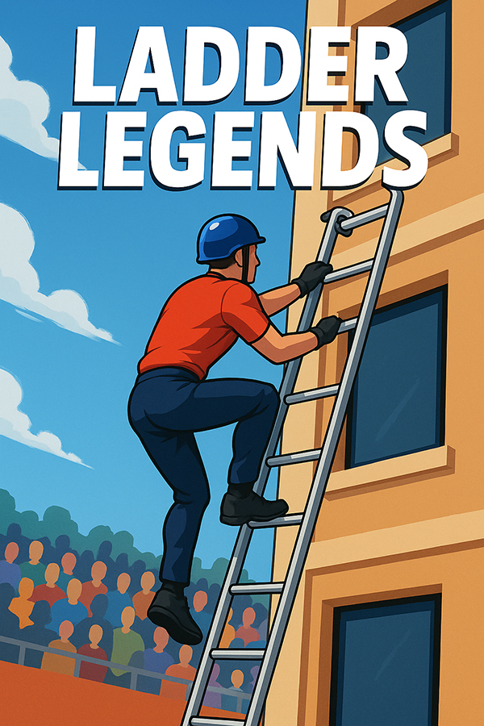

# Ladder Legends - Game Overview

> *“Run. Hook. Climb. Be the fastest to the top.”*

A fast-paced competitive climbing sport inspired by real firefighter competitions. Players race against time — and each other — to hook a ladder onto building windows and climb to victory. The game blends sprinting, precision, and climbing in a way that’s thrilling for both casual and competitive players.

## Narrative

The siren blares.\
Four racers line up, gripping their ladders. The crowd is buzzing. You can feel the ground shake from the thundering footsteps of the other competitors.

_**BANG!**_ The start pistol fires.\
You sprint forward, ladder bouncing in your hands. The building mock-up looms ahead — four stories tall, windows like targets. In one fluid move, you hook your ladder to the ledge and leap onto it, climbing like your life depends on it. The wind rushes past as you race to reach the top before anyone else.

In another event, you face the 100-Meter Fire Challenge: leap over fences, dash across a narrow bridge, duck under beams, and hit the finish line in record time. Your reflexes, speed, and timing decide everything.

Every race is different — slippery floors, moving targets, night-time lights, even roaring fire effects for the brave. Compete against friends, climb the global leaderboard, and unlock crazy skins for your racer and ladder.

Only the fastest, smartest, and most fearless will become the ultimate Ladder Legend.\
Are you ready to climb?

## Explaining the Real Sport

### Name & Core Concept

This sport is often referred to as Fire Sport and is part of firefighter competitions in ex-USSR countries. The sport simulates the speed, agility, and precision firefighters need to reach higher floors of a building using a special hook ladder.

### Main Discipline: Hook Ladder Climbing

- Under 15 years old: Competitors start without carrying the ladder — the ladder is already placed against the building (usually at the second-floor window). The task is to sprint from the starting line, reach the ladder, and climb to the second floor as fast as possible.
- Teenage/Adult Beginner: Competitors carry the ladder, run with it, and hook it onto the first-floor window, climb, then lift it and hook onto the second-floor window, and climb again.
- Advanced/Pro Level: Same process but continue up to the fourth floor. The entire sequence must be smooth — dropping the ladder or missing a hook costs precious seconds.

### Secondary Discipline: 100-Meter Firefighter Obstacle Race

- Course example: Sprint → jump over a fence → run across a narrow bridge/plank → connect a fire hose to a hydrant or target → dash to the finish.
- It’s a mix of sprinting, coordination, and quick hands.

### Why It’s Exciting

- It’s fast — world-class hook ladder climbs to the 4th floor happen in under 14 seconds.
- It’s skill-based — one tiny mistake can cost the win.
- It’s unique — unlike standard track-and-field races, this has vertical climbing, precision hooking, and real risk of falling.
- It’s a perfect blend of strength, speed, and technique.

## Game Overview

### 📌 Core Gameplay

* **Run**: Sprint towards the building with or without carrying your ladder.
* **Hook**: Aim and hook the ladder onto the correct window ledge.
* **Climb**: Scale the building floor by floor as quickly as possible.
* **Master**: Combine speed, accuracy, and flawless transitions to win.

### 🏆 Game Modes

1. **Career Mode** — Progress from Junior Cadet (2nd floor climb) to Pro Champion (4th floor climb).
2. **100-Meter Fire Challenge** — Sprint through fences, bridges, and hose tasks.
3. **Online Tournaments** — Race players worldwide in live or time-trial formats.
4. **Custom Course Creator** — Build and share your own race challenges.

### 🔑 Progression & Rewards

* Unlock **new ladders** (gold, carbon fiber, neon glow).
* Earn **racer outfits** and **helmet styles**.
* Compete for **global leaderboard rankings**.
* Titles: Cadet → Firefighter → Senior Firefighter → Ladder Legend.

### 🎨 Visual Style

* **Bright, competitive sports vibe** with clean, readable environments.
* Realistic climbing animations with slightly stylized proportions for clarity.
* Crowd-filled arenas for atmosphere.

### 🔊 Audio Style

* Dynamic crowd cheers that intensify near the finish.
* Metallic ladder clinks, fast breathing, and adrenaline-pumping music.

### 💡 Extra Features

* **Ghost Mode** — Race your past runs or friends’ times.
* **Replay Mode** — Watch your climb in cinematic slow motion.
* **Weather Challenges** — Rain, wind, and night lighting for variety.

### 🎯 Target Audience

* Ages 10+
* Fans of speedrunning, climbing, parkour, and competitive mini-sports games.
* Players who enjoy mastering skill-based challenges.
